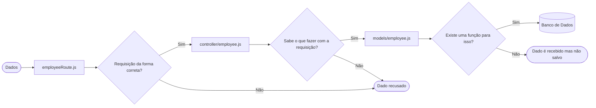

# API Rest com NodeJS, Express e MySQL
Olá! Desenvolvi esse projeto como uma forma de aprender melhor a criar uma API Restful e compreender o conteúdo que aprendi em alguns cursos. 

- O projeto é construído através do framework Express (ou ExpressJS). Ele é ótimo para a criação de APIs que utilizam a arquitetura REST para construção de APIs por ser muito bem otimizado e flexível. 
- O NodeJS é uma "ferramenta" (?) usada para complicar códigos em JavaScript fora do ambiente do navegador (que é onde o JS normalmente é executado).
- O MySQL é um sistema de gerenciamento de Banco de Dados, ou seja, uma forma de salvar informações como se fosse uma tabela do excel gigante e mais programável (e complicada, na minha opinião). 

Juntando tudo isso, temos uma API que é acessada através de requisições interpretadas pelo Express, cujo código e conteúdo e interpretado pelo NodeJS, e que salva o conteúdo recebido num Banco de Dados MySQL. 

## Funcionamento
O funcionamento está explicado dentro de cada arquivo, mas aqui vai um pequeno resumo de cada arquivo com uma explicação resumida em uma linha.

- db.config.js = Configura conexão até o Banco de Dados;
- index.js = Configura quais tipos de dados serão interpretados pela API e para onde devem ser enviados;
- employeeRoute.js = Recebe os dados e decide para onde enviá-los **dependendo da requisição feita**;
- controller/employee.js = Após receber os dados do employeeRoute, decide qual função realizar com os dados;
- models/employee.js = Define quais funções existem e, após a decisão do controller/employee.js, realiza a função desejada.

Não esqueça de instalar as dependências necessárias para executar esta API!